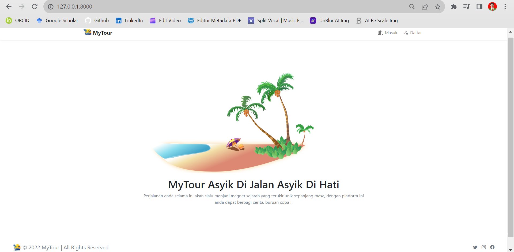
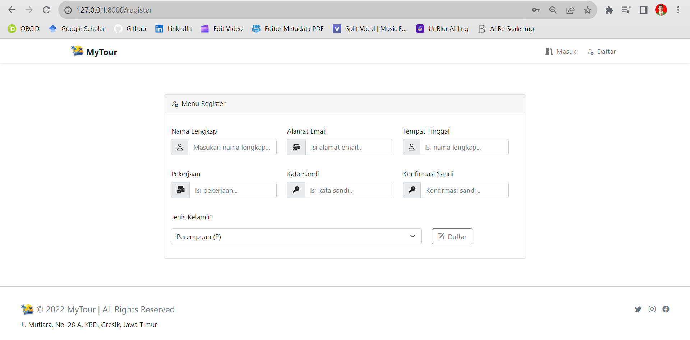
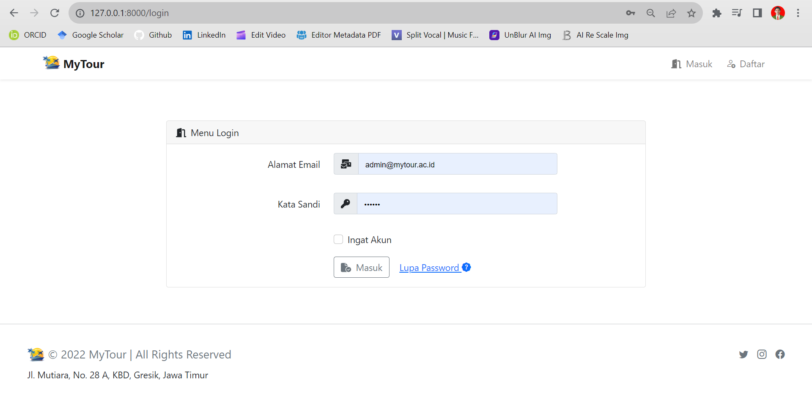
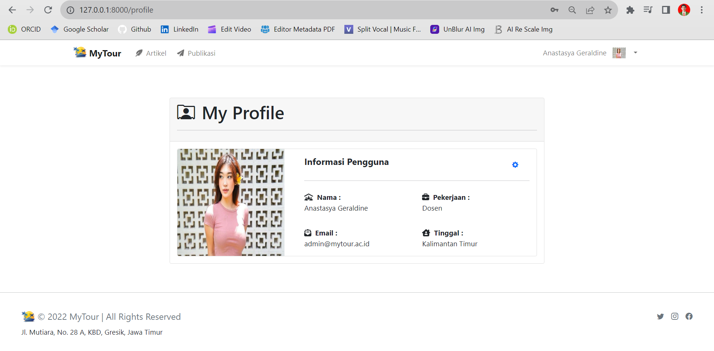

[](https://github.com/ellerbrock/open-source-badges/)
[](https://opensource.org/licenses/MIT)


# task-5-fullstack
<strong>Virtual Internship Experience (Investree) - Fullstack - Devan Cakra Mudra Wijaya</strong><br><br>
``` MyTour ``` is a web application that I developed during a virtual project-based internship program through the ``` Rakamin Academy ``` platform. This project was an initiative to design an internal solution aimed at supporting ``` employee well-being ``` within ``` Investree’s ``` work environment. The application focuses on providing a space for sharing light stories about travel experiences, such as weekend getaways, business trips, or other activities. Its purpose is to help maintain a healthy balance between employees’ personal and professional lives. ``` MyTour ``` features a core ``` story-sharing ``` functionality that allows users to share their travel moments through photos and written narratives. Unlike typical social media platforms, ``` MyTour ``` intentionally limits interaction by excluding a comment feature. This design approach is intended to reduce social pressure and create a more comfortable, simple, and distraction-free sharing experience for users.

<br><br>

## Project Requirements
| Part | Description |
| --- | --- |
| Features | • Login<br>• Create<br>• Read<br>• Update<br>• Delete<br>• Pagination |
| Framework | • Bootstrap 5<br>• Laravel 8<br>• Vue.js |
| Tools | • Visual Studio Code<br>• Xampp<br>• Node.js |

<br><br>

## Download & Install
1. XAMPP with PHP version 8

   <table><tr><td width="810">

   ```
   https://bit.ly/XAMPP_PHP8_Installer
   ```

   </td></tr></table><br>

2. Visual Studio Code

   <table><tr><td width="810">

   ```
   https://bit.ly/VScode_Installer
   ```

   </td></tr></table><br>

3. NodeJS

   <table><tr><td width="810">

   ```
   https://bit.ly/NodeJS_Installer
   ```

   </td></tr></table>

<br><br>

## Database
1. Open ``` XAMPP ```, then start the ``` Apache ``` & ``` MySQL ``` section to run a web server and a database server locally.<br><br>

2. Access the browser first in order to open the database admin panel, please copy the following link: ``` localhost/phpmyadmin/ ```.<br><br>

3. Create a database called ``` mytour ```.<br><br>

4. Open the ``` mytour ``` database and Import ``` mytour.sql ``` in the ``` MyTour/public/sql ``` directory.<br><br>

5. Then open the XAMP file: ``` php.ini ``` -> remove ``` semicolon (;) ``` in front of ``` extension=intl ``` -> save.

<br><br>

## Default Account
| Role | Email | Name | Password |
| --- | --- | --- | --- |
| Admin | admin@mytour.ac.id | Anastasya Geraldine | 456123 |
| User | user1@mytour.ac.id | Andikha Refanza | 456123 |
| User | user1@mytour.ac.id | Alfiansyah Nukita Prada | 456123 |

<br><br>

## Get Started
1. Download and extract this repository.<br><br>

2. Open the ``` MyTour ``` directory, then open ``` CMD ``` inside the directory.<br><br>

   • First, if no error occurs then just skip this step, but if otherwise then please copy the following command:

      <table><tr><td width="810">

      ````bash
      npm install
      ````

      </td></tr></table><br>

   • Secondly, this step is mandatory, so please copy the following command:

      <table><tr><td width="810">

      ````bash
      npm run dev
      ````

      </td></tr></table><br>

   • Third, this step is mandatory, so please copy the following command:

      <table><tr><td width="810">

      ````bash
      php artisan serve
      ````

      </td></tr></table><br>

3. Open ``` Chrome ``` -> Add extensions named ``` Vue.js devtools ```.<br><br>

4. Open your ``` browser ``` (New tab), then type -> ``` http://127.0.0.1:8000/ ``` or customize the one on your ``` CMD ```.<br><br>

5. Please login and access the features, enjoy [Done].

<br><br>

## Highlights
<table>
<tr>
<th width="280">Home</th>
<th width="280">Registration</th>
<th width="280">Login</th>
</tr>
<tr>
<td></td>
<td></td>
<td></td>
</tr>
</table>
<table>
<tr>
<th width="280">Password Reset</th>
<th width="280">Profile</th>
<th width="280">Profile Edit</th>
</tr>
<tr>
<td></td>
<td></td>
<td></td>
</tr>
</table>
<table>
<tr>
<th width="280">Write Article</th>
<th width="280">Manage Archives</th>
<th width="280">Change Article Feature</th>
</tr>
<tr>
<td></td>
<td></td>
<td></td>
</tr>
</table>
<table>
<tr>
<th width="280">Article Publication</th>
<th width="280">General Category</th>
<th width="280">Special Category</th>
</tr>
<tr>
<td></td>
<td></td>
<td></td>
</tr>
</table>

<br><br>

## Appreciation
If this work is useful to you, then support this work as a form of appreciation to the author by clicking the ``` ⭐Star ``` button at the top of the repository.

<br><br>

## Disclaimer
This application is my own work and is not the result of plagiarism from other people's research or work, except those related to third party services which include: libraries, frameworks, and so on.

<br><br>

## LICENSE
MIT License - Copyright © 2022 - Devan C. M. Wijaya, S.Kom

Permission is hereby granted without charge to any person obtaining a copy of this software and the software-related documentation files to deal in them without restriction, including without limitation the right to use, copy, modify, merge, publish, distribute, sublicense, and/or sell copies of the Software, and to permit persons receiving the Software to be furnished therewith on the following terms:

The above copyright notice and this permission notice must accompany all copies or substantial portions of the Software.

IN ANY EVENT, THE AUTHOR OR COPYRIGHT HOLDER HEREIN RETAINS FULL OWNERSHIP RIGHTS. THE SOFTWARE IS PROVIDED AS IS, WITHOUT WARRANTY OF ANY KIND, EITHER EXPRESS OR IMPLIED, THEREFORE IF ANY DAMAGE, LOSS, OR OTHERWISE ARISES FROM THE USE OR OTHER DEALINGS IN THE SOFTWARE, THE AUTHOR OR COPYRIGHT HOLDER SHALL NOT BE LIABLE, AS THE USE OF THE SOFTWARE IS NOT COMPELLED AT ALL, SO THE RISK IS YOUR OWN.
